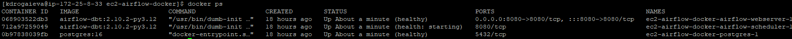

# EC2 Airflow + dbt in Docker

This folder contains everything needed to run **Airflow + dbt (Redshift)** in Docker on an **EC2 Amazon Linux 2023** instance.

Repo layout (relevant parts):

```
transformations/
├── airflow/
│   └── dags/
├── dbt/
│   └── LCom_DW/
└── infra/
    └── ec2-airflow-docker/
        ├── Dockerfile
        ├── docker-compose.yml
        ├── init_airflow.sh
        ├── start_airflow.sh
        ├── stop_airflow.sh
        └── airflow-docker.service
```

dbt profiles live outside the repo:

```
/home/kdrogaieva/dbt_profile/profiles.yml
```

smtp server password also lives outside the repo

```
/home/kdrogaieva/airflow_env/.smtp_password
```

"Hide" the content of the files. Only sudo nano works after that

```
sudo chmod 600 .smtp_password
sudo chown ec2-user:ec2-user .smtp_password 
```

```
sudo chmod 600 profiles.yml
sudo chown ec2-user:ec2-user profiles.yml 
```
airflow and dbt logs, airflow plugins (if any) and dbt target folders also should be outside the repo:

```
cd /home/kdrogaieva

mkdir airflow_logs
mkdir airflow_plugins
mkdir dbt_target
mkdir dbt_logs
```
All these folders are mapped as volumes in docker-compose.yml

## 1. Prerequisites on EC2

Install Docker, Compose, Git, and clone the repository.

```
# Update packages
sudo dnf update -y
```

Docker
```
# Install Docker
sudo dnf install -y docker

# Enable and start Docker service
sudo systemctl enable docker
sudo systemctl start docker

# Check status
sudo systemctl status docker

# Add your user to the docker group so you can run docker without sudo
sudo usermod -aG docker kdrogaieva

# for group change to take effect
 newgrp docker

# Quick test:
docker run --rm hello-world

```
Docker Compose
```
# Install Docker Compose

sudo mkdir -p /usr/local/lib/docker/cli-plugins

# download the latest Compose V2 binary
sudo curl -SL \
  https://github.com/docker/compose/releases/download/v2.29.7/docker-compose-linux-x86_64 \
  -o /usr/local/lib/docker/cli-plugins/docker-compose

# Make it executable:
sudo chmod +x /usr/local/lib/docker/cli-plugins/docker-compose

# Verify
docker compose version

```
Git
```
# Install git
sudo dnf install -y git

# Verify
git --version

# Configure Git Identity (required)
git config --global user.name "Your Name"
git config --global user.email "your.email@company.com"

# Verify
git config --global --list
```


Connect to GitHub/Bitbucket

1. Check if you already have a key on host:

```
ls -la ~/.ssh
```

2. If no, Generate key on host:
```
ssh-keygen -t ed25519 -C "your.email@company.com"
```
3. It creates id_ed25519.pub and  id_ed2551 files in /home/kdrogaieva/.ssh
```
# Fix SSH Permissions (I did not do it. Is it requred?)
chmod 700 ~/.ssh
chmod 600 ~/.ssh/id_ed25519
chmod 644 ~/.ssh/id_ed25519.pub
```
4. Start SSH Agent and Add Key (I did not do it. Is it requred?)
```
eval "$(ssh-agent -s)"
ssh-add ~/.ssh/id_ed25519
ssh-add -l
# Confirm

```
5. Copy the content of id_ed25519.pub to 
GitHub → Repo → Settings → Deploy keys (read-only is fine)
and/or 
Bitbucket → Personal settings → SSH keys → Add key -> SSH Public Key*
```
cat id_ed25519.pub
```
6. Test 
```
ssh -T git@bitbucket.org
```
If you get a host key prompt, type yes. A successful auth usually prints a greeting.

Add github to the known hosts
ssh-keyscan github.com >> ~/.ssh/known_hosts

or with sudo if you are not teh owner

sudo ssh-keyscan github.com | sudo tee -a /home/kdrogaieva/.ssh/known_hosts > /dev/null

and then, change the owner

sudo chown -R kdrogaieva:kdrogaieva /home/kdrogaieva/.ssh
chmod 700 /home/kdrogaieva/.ssh
chmod 600 /home/kdrogaieva/.ssh/known_hosts


7. In Docker, mount your SSH folder in docker-compose.yml
```
# SSH keys from EC2 host → container /root/.ssh
      - /home/kdrogaieva/.ssh:/root/.ssh:ro
```

8. Clone the repo
```
git clone git@bitbucket.org:learningcom/transformations.git
```

### Transformation folder with dbt and dag scripts is mounted as a volume in docker-compose.yml


## 2. One-time setup

With all files available in transformations/infra/ec2-airflow-docker and profiles.yml in /home/kdrogaieva/dbt_profile/ as well as 
.smtp_password in /home/kdrogaieva/airflow_env/ these one-time steps should be performed:

1. Work in transformations/infra/ec2-airflow-docker
```
cd transformations/infra/ec2-airflow-docker
```
2. Create airflow.env file for secrets in /home/kdrogaieva/
```
# Fernet key
Python3 - << 'PY'
from cryptography.fernet import Fernet
print(Fernet.generate_key().decode())
PY

# Secret key (random string)
openssl rand -base64 32

# Paste in airflow.env
nano airflow.env
```
3. Make sh executable
```
chmod +x start_airflow.sh stop_airflow.sh init_airflow.sh
```
4. Build the image
```
 docker build -t airflow-dbt:2.10.2-py3.12 .
```
5. Initialize Airflow DB + admin user:
```
./init_airflow.sh
```

This will:

5.1. docker compose up airflow-init
    
This creates one container named airflow-init, using the image: airflow-dbt:2.10.2-py3.12
    
It runs only long enough to:
- migrate the Airflow DB
- create the admin user
- then exit
    
5.2. docker compose up -d airflow-webserver airflow-scheduler 
    
This starts two more containers, both using the same image:  airflow-dbt:2.10.2-py3.12
    
airflow-dbt:2.10.2-py3.12
    
- airflow-webserver
- airflow-scheduler

6. Check from EC2 host (wait~2 min before the check when  it starts working):
curl http://localhost:8080/health

7. Configure laptop via PuTTY (SSH tunnel):

    7.1 Session:

- Host: your EC2 public DNS or IP
- Port: 22
- Connection type: SSH

    7.2 On the left: Connection → SSH → Tunnels

    7.3 Under Add new forwarded port:

- Source port: 8080
- Destination: localhost:8080
- Type: Local, click Add

    7.4 Connect with PuTTY (and keep session open as well as VPN).

On your laptop, open browser:
http://localhost:8080

8. Set up systemd service for the Airflow stack
```
# Copy the prepared file from teh repo to the system folder
cp home/kdrogaieva/transformations/infra/ec2-airflow-docker/airflow-docker.service /etc/systemd/system/airflow-docker.service

# Reload systemd units
sudo systemctl daemon-reload

# Enable service at boot
sudo systemctl enable airflow-docker

# Start it now
sudo systemctl start airflow-docker

# Check service status
sudo systemctl status airflow-docker

# Reboot test
sudo reboot
```

After reboot

```
sudo docker ps
sudo systemctl status airflow-docker.service
```

## 3. How Airflow starts on reboot

Docker is enabled via systemd and starts automatically on OS boot. A systemd oneshot service (airflow-docker.service) runs on boot after Docker starts.

## 4. A containre crash

### It does not come back automatically Need to test/ivestigate more

Airflow services (webserver, scheduler, Postgres) are defined in docker-compose.yml with restart: unless-stopped, so if a container crashes or Docker restarts, the container should come back automatically unless it was intentionally stopped, but it does not


## 5. How health is handled

Airflow services include Docker health checks (e.g., the webserver /health endpoint). These mark containers as healthy or unhealthy for visibility and diagnostics, but they do not trigger automatic restarts by themselves. 

## 6. Daily workflow

Use stop_airflow.sh to stop services.

Use start_airflow.sh to start Airflow services

Use docker ps to check if containers run



## 7. Running dbt manually

Use 
```
cd transformations/infra/ec2-airflow-docker
docker compose exec airflow-webserver bash 

# inside container:

cd /opt/airflow/transformations/

git pull origin master

cd /opt/airflow/transformations/dbt/LCom_DW

dbt debug
dbt test

```


## 8. Persisted folders

logs/ plugins/ and pgdata/ are created automatically, bind mounted and should be ignored by Git.

## 9. What should be done next

### It does not come back automatically Need to test/ivestigate more
Airflow services (webserver, scheduler, Postgres) are defined in docker-compose.yml with restart: unless-stopped, so if a container crashes or Docker restarts, the container comes back automatically unless it was intentionally stopped.


Add alerting and monitoring before any auto-remediation: notify on unhealthy containers, scheduler issues, disk usage, and Docker/service failures. If auto-restart-on-unhealthy is ever added, it must be boot-safe (grace period, rate limits, backoff). Also add disk/log management and a short operational runbook to guide diagnosis and recovery.


