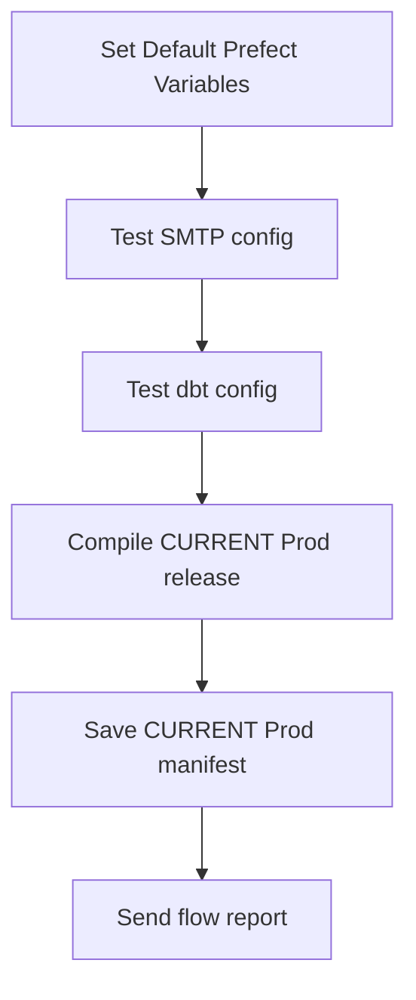

# Flow diagram for `ci_cd_flow_1_prepare_validate_current`

Generated automatically from source code.

```mermaid
graph TD
    S1["Set Default Prefect Variables"]
    S1 --> S2["Test SMTP config"]
    S2 --> S3["Test dbt config"]
    S3 --> S4["Compile CURRENT Prod release"]
    S4 --> S5["Save CURRENT Prod manifest"]
    S5 --> R6["Send flow report"]
```
