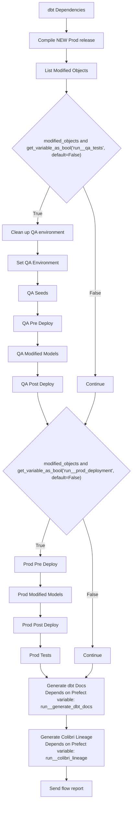

# Flow diagram for `ci_cd_flow_2_validate_deploy_new`

Generated automatically from source code.

```mermaid
graph TD
    S1["dbt Dependencies"]
    S1 --> S2["Compile NEW Prod release"]
    S2 --> T3["List Modified Objects"]
    T3 --> D4{"modified_objects and get_variable_as_bool('run__qa_tests', default=False)"}
    D4 -->|True| S5["Clean up QA environment"]
    S5 --> S6["Set QA Environment"]
    S6 --> S7["QA Seeds"]
    S7 --> S8["QA Pre Deploy"]
    S8 --> S9["QA Modified Models"]
    S9 --> S10["QA Post Deploy"]
    D4 -->|False| C11["Continue"]
    S10 --> D12{"modified_objects and get_variable_as_bool('run__prod_deployment', default=False)"}
    C11 --> D12
    D12 -->|True| S13["Prod Pre Deploy"]
    S13 --> S14["Prod Modified Models"]
    S14 --> S15["Prod Post Deploy"]
    S15 --> S16["Prod Tests"]
    D12 -->|False| C17["Continue"]
    S16 --> S18["Generate dbt Docs<br/>Depends on Prefect variable: run__generate_dbt_docs"]
    C17 --> S18
    S18 --> S19["Generate Colibri Lineage<br/>Depends on Prefect variable: run__colibri_lineage"]
    S19 --> R20["Send flow report"]
```
