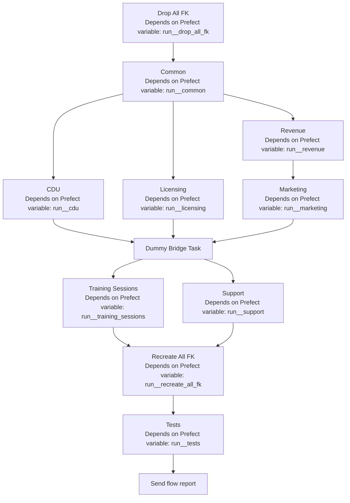

# Flow diagram for `lcom_dw_main_scheduled_run_flow`

Generated automatically from source code.

```mermaid
graph TD
    S1["Drop All FK<br/>Depends on Prefect variable: run__drop_all_fk"]
    S1 --> S2["Common<br/>Depends on Prefect variable: run__common"]
    S2 --> P3["CDU<br/>Depends on Prefect variable: run__cdu"]
    S2 --> P4["Licensing<br/>Depends on Prefect variable: run__licensing"]
    S2 --> P5["Revenue<br/>Depends on Prefect variable: run__revenue"]
    P5 --> P6["Marketing<br/>Depends on Prefect variable: run__marketing"]
    P3 --> S7["Dummy Bridge Task"]
    P4 --> S7
    P6 --> S7
    S7 --> P8["Training Sessions<br/>Depends on Prefect variable: run__training_sessions"]
    S7 --> P9["Support<br/>Depends on Prefect variable: run__support"]
    P8 --> S10["Recreate All FK<br/>Depends on Prefect variable: run__recreate_all_fk"]
    P9 --> S10
    S10 --> S11["Tests<br/>Depends on Prefect variable: run__tests"]
    S11 --> R12["Send flow report"]
```
