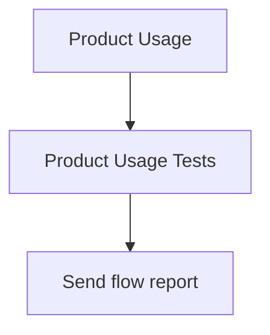

# Flow diagram for `lcom_dw_product_usage_scheduled_run_flow`

Generated automatically from source code.

```mermaid
graph TD
    S1["Product Usage"]
    S1 --> S2["Product Usage Tests"]
    S2 --> R3["Send flow report"]
```
