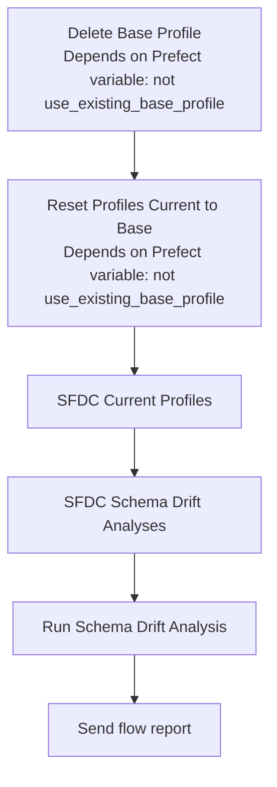

# Flow diagram for `sfdc_schema_drift_audit_flow`

Generated automatically from source code.

```mermaid
graph TD
    S1["Delete Base Profile<br/>Depends on Prefect variable: not use_existing_base_profile"]
    S1 --> S2["Reset Profiles Current to Base<br/>Depends on Prefect variable: not use_existing_base_profile"]
    S2 --> S3["SFDC Current Profiles"]
    S3 --> S4["SFDC Schema Drift Analyses"]
    S4 --> S5["Run Schema Drift Analysis"]
    S5 --> R6["Send flow report"]
```
